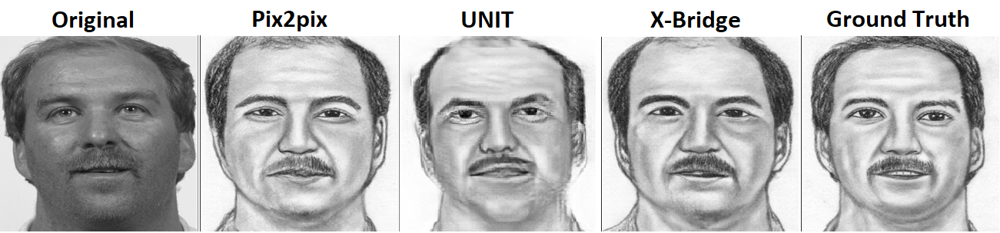
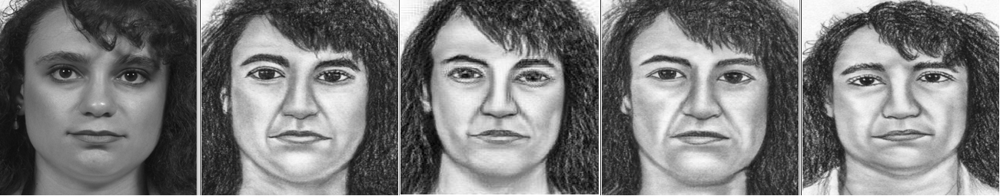
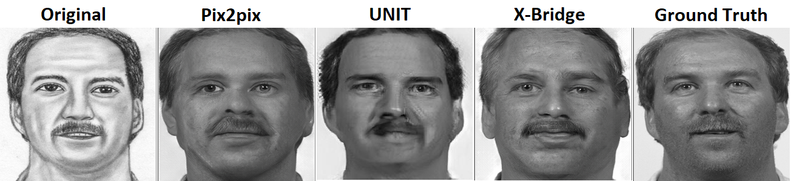
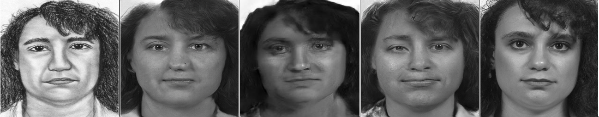
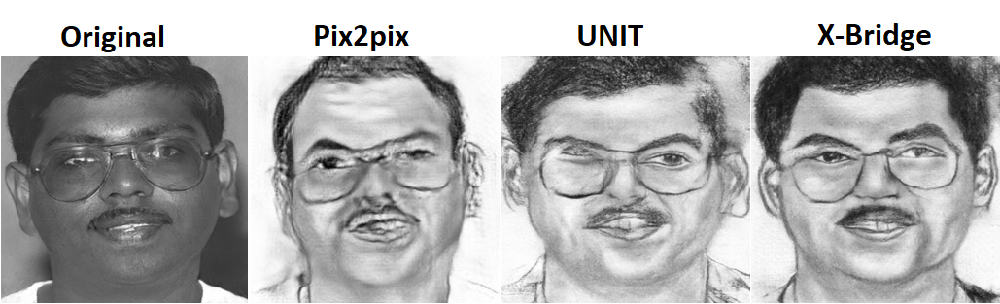
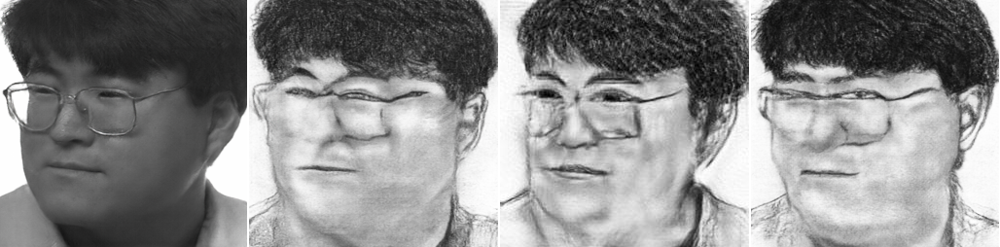
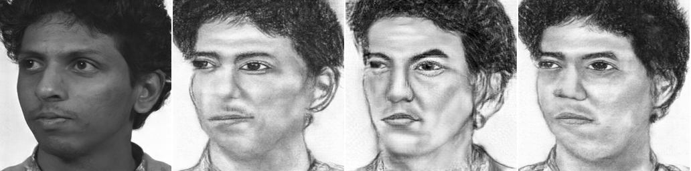
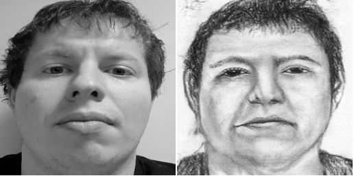

# X-Bridge

An addition of a novel X-Bridge method into [existing framework](https://github.com/junyanz/pytorch-CycleGAN-and-pix2pix
) for training  [pix2pix](https://phillipi.github.io/pix2pix/)
and [CycleGan](https://junyanz.github.io/CycleGAN/) in PyTorch. 
X-Bridge was developed as a cross-modal bridge method for _img2sketch_ and _sketch2img_
translation in heterogeneous face recognition tasks within my dissertation work 
_**Heteroheneous Face Recognition from Facial Sketches**_.

### Method overview

X-Bridge is supervised method (i.e. needs image pairs for the training) combining ideas from both older approaches - 
[pix2pix](https://phillipi.github.io/pix2pix/) and [UNIT](https://github.com/mingyuliutw/UNIT). To be more specific, 
the usage of L1 loss and conditional discriminator from Pix2pix, and the idea of shared-latent space from UNIT. By 
combining these ideas and by adding of a reconstruction path, I reached very realistic and precise results 
in image-to-sketch and sketch-to-image translation tasks. In this task, the X-Bridge method provides 
better generalization comparing to Pix2pix and also better detail generation comparing to UNIT.

X-Bridge pipeline. _E_ = encoder, _G1_;_G2_ = generators, _D1_;_D2_ = discriminators, 
z = latent space. Dotted line indicates L1 loss. xr is real input from the first domain, x^f is
reconstructed fake image from the first domain, x^f is translated fake image from the second
domain, x^r is corresponding real image from the second domain. The translation path is on
the left, whereas, the reconstruction path on the right.


### Exemplary results

**Used dataset** - [CUFSF](http://mmlab.ie.cuhk.edu.hk/archive/cufsf/)

**Real-to-sketch translation**



**Sketch-to-real translation**



**Glasses and non-frontal pose translation**




**Real-world image translation**



### Training 
 ```
 python train.py --dataroot ./datasets/feret_sketch_highres --name feret_sketch_my --model XBridge --direction AtoB
 ```
 
### Testing
 ```
 python test.py --dataroot ./datasets/feret_sketch_highres --name feret_sketch_my --model XBridge --direction AtoB
 ```

### Acknowledgement
Most of the project codes are based on 
https://github.com/junyanz/pytorch-CycleGAN-and-pix2pix

### Contact
 ```
 [Ivan Gruber](grubiv@ntis.zcu.cz)
 ```
